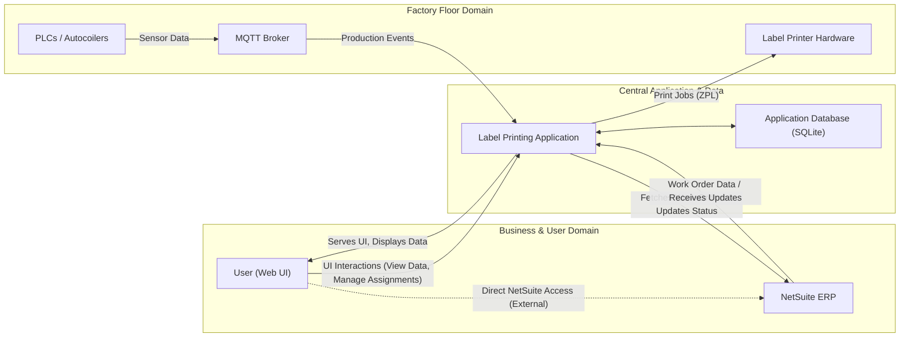
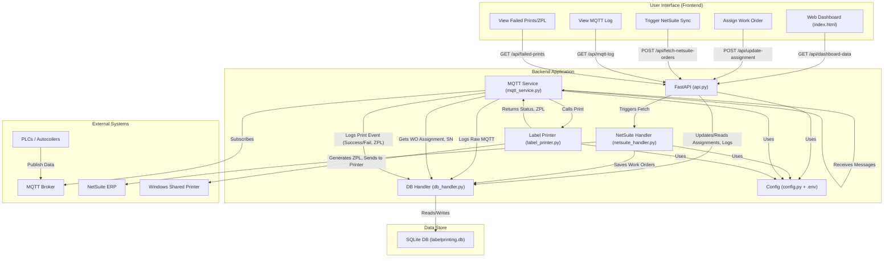

# Automatic Label Printing and Work Order Management System for Cable Manufacturing using Auto-coilers

## Overview

This application is designed to integrate with NetSuite to fetch work orders, manage machine assignments for these work orders, and interact with an MQTT broker to receive real-time data from shop floor machines (Autocoilers). Based on MQTT triggers and active assignments, it generates ZPL labels for printing and logs production data. The system features a web-based UI for monitoring and managing assignments.

## Problem Statement

In many discrete manufacturing environments, particularly in industries like cable manufacturing, a critical gap exists between real-time shop-floor activities and the central enterprise resource planning (ERP) system. This disconnection typically results in:

*   **Manual Data Entry:** Operators or supervisors must manually record production output, quality status, and material consumption, leading to delays and a high risk of human error.
*   **Delayed Visibility:** Management has no real-time view of production status. Reports are often hours or days old, making proactive decision-making impossible.
*   **Traceability Challenges:** Manually created labels and production logs make it difficult to maintain a robust, auditable trail for each product, a key requirement for quality standards like IATF 16949.

This application was architected and built as a proof-of-concept to solve these core challenges. It serves as a blueprint for a system that creates a direct, automated link between MQTT-enabled shop-floor machines and a NetSuite ERP, enabling automated label printing, real-time production logging, and a single source of truth for manufacturing operations.

## Features

*   **NetSuite Integration:** Fetches work orders using a RESTlet.
*   **MQTT Integration:** Listens to specified MQTT topics for messages from Autocoilers.
*   **Database Storage:** Uses SQLite to store work orders, machine assignments, print logs, and MQTT message logs.
*   **Dynamic Label Printing:** Generates ZPL labels based on work order and machine data.
*   **Web Interface:**
    *   Displays available work orders.
    *   Allows assignment of work orders to machines.
    *   Shows current machine assignments and their printing status.
    *   Provides production summary for assigned work orders (total coils, recent coil details, total quantity).
    *   Live log of MQTT messages.
    *   Client-side filtering for work orders by MFG Process and Location.
*   **Configurable:** Uses a `.env` file for managing application settings.
*   **Debug Mode:** Controllable via an `APP_DEBUG` environment variable to show/hide debug logs.

*   **ZPL Inspector:** UI panel to view ZPL for failed print jobs.

## Application Workflow

This system orchestrates data flow between NetSuite, PLCs (via MQTT), a local database, a label printer, and a web UI.

1.  **Work Order Management:**
    *   Work orders are fetched from **NetSuite** (triggered via the UI or potentially on a schedule) by the `netsuite_handler.py` module.
    *   Fetched work orders are stored in the **SQLite Database** (`labelprinting.db`) by `db_handler.py`.
    *   The **Web UI** (`frontend/index.html`) displays available work orders from the database via `api.py`.
    *   Users can assign work orders to specific machines (Autocoilers) through the Web UI. These assignments are saved in the database.

2.  **Real-time Machine Interaction & Label Printing:**
    *   **PLCs/Autocoilers** on the shop floor publish data (e.g., coil completion, quality metrics) to an **MQTT Broker** on predefined topics.
    *   The `mqtt_service.py` continuously listens to these MQTT topics.
    *   Upon receiving a relevant message:
        *   The raw MQTT message is logged to the database.
        *   `mqtt_service.py` checks the database for an active work order assignment for the reporting machine.
        *   If an assignment exists:
            *   A unique serial number is generated (sequence managed in the database).
            *   Label data is compiled using work order details and machine data.
            *   `label_printer.py` is called to:
                *   Generate the ZPL (Zebra Programming Language) code for the label.
                *   Attempt to send the ZPL to the configured **Windows Shared Printer**.
            *   The print attempt (success or failure, along with the ZPL code and any error messages) is logged in the `print_log` table in the database by `db_handler.py`.

3.  **Monitoring & Reporting (Web UI):**
    *   The Web UI, served by `api.py`, provides:
        *   A dashboard view of machine assignments and their current status.
        *   Production summaries (total coils, quantity, recent serial numbers) derived from the `print_log` table.
        *   A live log of raw MQTT messages received.
        *   An inspector for failed print jobs, allowing users to view the ZPL content of labels that failed to print.

### High-Level System Components

This diagram illustrates the main architectural components and their primary relationships, with the application at the center.



### Detailed Workflow Diagram (Mermaid)



## Prerequisites

*   Python 3.9+
*   `pip` (Python package installer)
*   Node.js (for `jwt_generator.js` used by `netsuite_handler.py`)
*   An MQTT Broker accessible by the application.
*   A Windows Shared ZPL-compatible printer accessible by the application (configurable via its UNC path).

## Project Structure


## Setup Instructions

1.  **Clone the Repository (if applicable)**
    If you're setting this up from a Git repository:
    ```bash
    git clone <repository_url>
    cd <repository_directory>
    ```

2.  **Create and Activate a Python Virtual Environment**
    ```bash
    python -m venv .venv
    # On Windows
    .\.venv\Scripts\activate
    # On macOS/Linux
    source .venv/bin/activate
    ```

3.  **Install Python Dependencies**
    ```bash
    pip install -r requirements.txt
    ```

4.  **Set up Node.js Dependencies (for NetSuite JWT generation)**
    If `netsuite_handler.py` uses `jwt_generator.js`:
    ```bash
    # Ensure Node.js and npm are installed
    # If jwt_generator.js has its own package.json, navigate to its directory and run:
    # npm install 
    ```
    (Currently, `jwt_generator.js` is called directly by `netsuite_handler.py` without its own `package.json` in this project, so this step might only involve ensuring Node.js is available.)

5.  **Create and Configure the `.env` File**
    Create a file named `.env` in the project root directory. Copy the example below and fill in your actual credentials and settings:
    ```env
    # Application Settings
    APP_DEBUG=True # Set to False to disable debug logs

    # MQTT Broker Settings
    MQTT_BROKER_HOST=your_mqtt_broker_ip_or_hostname
    MQTT_BROKER_PORT=1883
    MQTT_BROKER_USERNAME=your_mqtt_username
    MQTT_BROKER_PASSWORD=your_mqtt_password

    # Database Settings (SQLite)
    # For the current SQLite setup, only DB_NAME is actively used by config.py to form the DATABASE_URL.
    # The other DB_HOST, DB_PORT, DB_USER, DB_PASSWORD variables are not used for SQLite.
    DB_NAME=labelprinting.db # This will create labelprinting.db in the project root

    # NetSuite API Configuration
    ACCOUNT_ID="your_netsuite_account_id"
    CONSUMER_KEY="your_netsuite_consumer_key"
    CERTIFICATE_ID="your_netsuite_certificate_id"
    SCRIPT_ID=your_netsuite_script_id
    DEPLOY_ID=your_netsuite_deploy_id
    CREATED_AT_MIN="YYYY-MM-DD" # Default start date for fetching WOs, can be overridden by UI
    PRIVATE_KEY_PATH="netsuite_connector/sw2021d_key.pem"
    JWT_GENERATOR_PATH="jwt_generator.js"

    # Printer Settings (for Windows Shared Printer using win32print)
    PRINTER_IP=\\\\your_server_name\\your_printer_share_name # e.g., \\\\re-coiling\\Recoil
    # PRINTER_PORT is not used when printing to a Windows Shared Printer via win32print.
    PRINTER_PORT=9100

    # Optional Graylog Settings (if used)
    # GRAYLOG_HOST=localhost
    # GRAYLOG_PORT=12201
    ```
    **Important:** Ensure `netsuite_connector/sw2021d_key.pem` exists and is correctly referenced.

6.  **Create the Database**
    Run the script to create the SQLite database and its tables:
    ```bash
    python create_db.py
    ```
    If you need to recreate the database (e.g., after schema changes), delete `labelprinting.db` first, then run this script.

## Running the Application

You need to run two main components in separate terminals: the FastAPI backend and the MQTT service.

1.  **Start the FastAPI Backend:**
    (Ensure your virtual environment is activated)
    ```bash
    python -m uvicorn api:app --reload --port 3001
    ```
    The API will be available at `http://127.0.0.1:3001`.

2.  **Start the MQTT Service:**
    (Ensure your virtual environment is activated, in a new terminal)
    ```bash
    python mqtt_service.py
    ```
    This service will connect to the MQTT broker and process messages.

3.  **Access the Frontend:**
    Open `frontend/index.html` in your web browser. It should connect to the API running on port 3001.

## Migrating to a New Computer

To migrate this application to a new computer, follow these steps:

**I. Prerequisites on the New Computer:**

1.  **Python:** Install a compatible version of Python (e.g., Python 3.9+). Ensure `python` and `pip` are added to the system's PATH.
2.  **Node.js (Potentially):** If `jwt_generator.js` is used for NetSuite JWT generation (as configured by `NS_JWT_GENERATOR_PATH` in `.env`), Node.js will need to be installed.
3.  **Access to Resources:**
    *   Network access to the MQTT broker.
    *   Network access to the NetSuite endpoint.
    *   Network access to the shared printer (e.g., `\\re-coiling\Recoil`).
    *   If the database `labelprinting.db` is to be shared or moved, ensure the new location is accessible by the application.

**II. Transferring Application Files:**

1.  **Copy the Entire Project Directory:**
    *   Transfer the whole project folder (containing `api.py`, `mqtt_service.py`, `frontend/`, etc.) to the new computer. This can be done via USB, network share, or version control (Git).
    *   **Essential files/folders to include:**
        *   All Python scripts (`.py` files).
        *   The `frontend/` directory.
        *   `requirements.txt`.
        *   The `.env` file (transfer securely as it contains credentials).
        *   The NetSuite private key file (e.g., `ns_private_key.pem`).
        *   `jwt_generator.js` (if used).
        *   The SQLite database file (`labelprinting.db`) if migrating existing data.
        *   `README.md` and `.gitignore`.

**III. Setting up the Environment on the New Computer:**

1.  **Open a Terminal/Command Prompt** in the root of the copied project directory.
2.  **Create a Python Virtual Environment (Recommended):**
    ```bash
    python -m venv .venv
    ```
    (Or your preferred virtual environment name, e.g., `venv`)
3.  **Activate the Virtual Environment:**
    *   Windows: `.\.venv\Scripts\activate`
    *   macOS/Linux: `source .venv/bin/activate`
4.  **Install Dependencies:**
    ```bash
    pip install -r requirements.txt
    ```

**IV. Configuration:**

1.  **Review and Update `.env` File:**
    *   Open the `.env` file on the new computer.
    *   Verify and update all paths and settings for the new environment:
        *   MQTT Broker details (`MQTT_BROKER_HOST`, `PORT`, `USERNAME`, `PASSWORD`).
        *   NetSuite settings (`ACCOUNT_ID`, `CONSUMER_KEY`, etc.).
        *   `NS_PRIVATE_KEY_PATH`: Ensure this points to the correct location of your NetSuite private key file on the new computer.
        *   `NS_JWT_GENERATOR_PATH`: If using the external JS script, ensure this path is correct.
        *   `PRINTER_IP`: This will need to be the correct UNC path for the printer accessible from the new machine (e.g., `\\re-coiling\Recoil`).
        *   The `DATABASE_URL` in `config.py` is currently `sqlite+aiosqlite:///labelprinting.db`. This means it will look for (or create) `labelprinting.db` in the directory where the scripts are run. If you copied an existing `labelprinting.db`, ensure it's in the project root.

**V. Database Setup:**

1.  **If migrating existing data:**
    *   Ensure the `labelprinting.db` file was copied to the project root on the new machine. The application should use it directly.
2.  **If starting fresh (no existing data to migrate):**
    *   Run the `create_db.py` script once to create the `labelprinting.db` file and its schema:
        ```bash
        python create_db.py
        ```

**VI. Running the Application:**

1.  **Start the FastAPI/Uvicorn server:**
    (Ensure virtual environment is activated)
    ```bash
    python -m uvicorn api:app --reload --port 3001
    ```
2.  **Start the MQTT service:**
    (Ensure virtual environment is activated, in a new terminal)
    ```bash
    python mqtt_service.py
    ```

**VII. Printer Setup on the New Machine:**

*   The new computer must have the necessary printer drivers installed if it's a direct connection or if the shared printer requires specific client-side drivers.
*   Ensure the new machine can access the shared printer path specified in `PRINTER_IP`.

## Key Configuration Variables (`.env` file)

*   `APP_DEBUG`: `True` or `False`. Enables/disables debug logging.
*   `MQTT_BROKER_HOST`: Hostname or IP of your MQTT broker.
*   `MQTT_BROKER_PORT`: Port for MQTT broker (default 1883).
*   `MQTT_BROKER_USERNAME`: Username for MQTT authentication.
*   `MQTT_BROKER_PASSWORD`: Password for MQTT authentication.
*   `DB_NAME`: Name of the SQLite database file (e.g., `labelprinting.db`). `config.py` uses this to form the `DATABASE_URL` for a local SQLite file. Other `DB_HOST`, `DB_PORT`, `DB_USER`, `DB_PASSWORD` variables in `.env` are not used with the current SQLite setup.
*   `ACCOUNT_ID`, `CONSUMER_KEY`, `CERTIFICATE_ID`, `SCRIPT_ID`, `DEPLOY_ID`: NetSuite API credentials and RESTlet info.
*   `CREATED_AT_MIN`: Default start date (YYYY-MM-DD) for fetching NetSuite work orders.
*   `PRIVATE_KEY_PATH`: Path to your NetSuite private key file.
*   `JWT_GENERATOR_PATH`: Path to the Node.js JWT generator script.
*   `PRINTER_IP`: The UNC path to your Windows Shared ZPL printer (e.g., `\\\\server_name\\printer_share_name`). This is used by `win32print`.
*   `PRINTER_PORT`: Not actively used when printing to a Windows Shared Printer via `win32print`. (Typically 9100 for direct socket printing).
