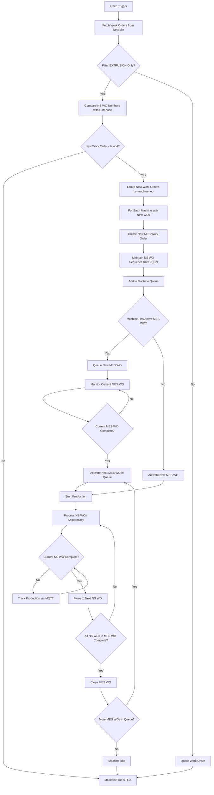
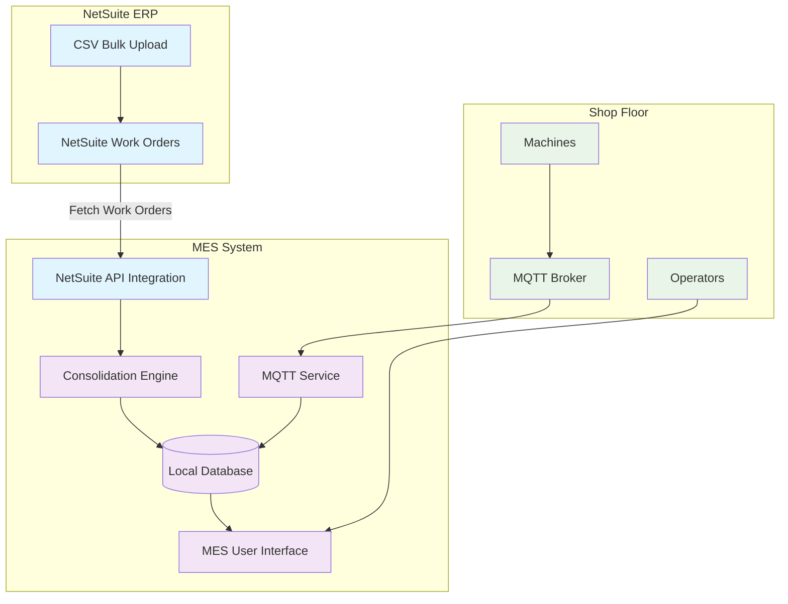

# Work Order Consolidation - Product Requirements Document

## 1. Executive Summary

### 1.1 Purpose
This document defines the requirements for implementing work order consolidation functionality in a Manufacturing Execution System (MES) that integrates with NetSuite ERP. The system will consolidate multiple NetSuite work orders by machine number to optimize production scheduling and tracking.

### 1.2 Scope
- **In Scope**: EXTRUSION manufacturing process work orders only
- **Out of Scope**: Non-extrusion processes (RBD, BUNCHING, MWD, etc.)
- **Integration Points**: NetSuite ERP (data source), Shop Floor Machines, MQTT Broker

## 2. Business Context

### 2.1 Standard Operating Procedure
Our current SOP involves creating individual work orders in NetSuite per MCPL part code, with bulk CSV uploads occurring multiple times per day. The MES system needs to consolidate these work orders by machine for efficient shop floor operations while maintaining full traceability.

### 2.2 Larger Workflow Context
This work order consolidation is part of a larger manufacturing workflow that includes:
- **Input Material Validation**: Operators scan MESWO QR codes and input copper serial numbers/barcodes
- **Pokayoke Logic**: System validates bunched copper against BOM specifications from JSON before allowing MESWO to start
- **Component Traceability**: All items have bunched copper part numbers and quantities defined in the BOM within the JSON structure

*Note: Material validation and pokayoke logic are separate from this consolidation requirement but provide important context.*

## 3. Consolidation Algorithm



## 4. System Architecture



### 3.1 Work Order Hierarchy
```
NetSuite Work Orders (NS WO) → Fetch Sessions → MES Consolidated Work Orders → Production Tracking
```

### 3.2 Dual Work Order Number System
- **NetSuite Work Order Number (NS WO)**: Original work order number from NetSuite
- **MES Work Order Number (MES WO)**: Consolidated work order number for shop floor operations

## 5. Functional Requirements

### 5.1 Work Order Consolidation

#### 5.1.1 Work Order Fetching
- **REQ-001**: System shall fetch work orders from NetSuite via API integration (periodic polling OR manual trigger)
- **REQ-002**: System shall identify new work orders by comparing NS work order numbers against existing database records
- **REQ-003**: Fetched work orders shall be stored in local database with full traceability
- **REQ-004**: Work orders with dates in the past shall be ignored and not processed

#### 5.1.2 Fetch-Based Consolidation Logic
- **REQ-005**: System shall consolidate new NetSuite work orders by `machine_no` and `fetch_session`
- **REQ-006**: Each fetch session shall create separate MES work orders per machine:
  - **Fetch 1**: 9 NS work orders for Machine 5 → creates MESWO1
  - **Fetch 2**: 5 additional NS work orders for Machine 5 → creates MESWO2
- **REQ-007**: New work orders from a fetch shall be identified by:
  - Comparing total work order count (e.g., 9 in fetch 1, 14 in fetch 2)
  - Identifying NS work order numbers not in existing database
  - New work orders = Total current - Previously stored
- **REQ-008**: Work order sequence within each MES work order shall follow the order provided in NetSuite JSON response
- **REQ-009**: If a fetch returns 0 new work orders, system shall maintain status quo without creating new MES work orders
- **REQ-010**: Only work orders with `mfg_process_name = "EXTRUSION"` shall be processed

### 5.2 Work Order Sequencing and Execution

#### 5.2.1 MES Work Order Queue Management
- **REQ-011**: Multiple MES work orders for the same machine shall be processed in chronological order (first-fetch-first-execute)
- **REQ-012**: MESWO2 cannot start until MESWO1 is completed or manually stopped
- **REQ-013**: System shall maintain a queue of MES work orders per machine
- **REQ-014**: Only one MES work order per machine can be active at any time

#### 5.2.2 Sequential Processing Within MES Work Order
- **REQ-015**: NetSuite work orders within a MES work order shall be processed sequentially as ordered in NetSuite JSON
- **REQ-016**: System shall track current NetSuite work order being processed within active MES work order
- **REQ-017**: Production cannot start on next NetSuite work order until current one is completed or manually stopped

#### 5.2.3 Work Order Control and Transitions
- **REQ-018**: Operators shall have ability to stop current MES work order at any point
- **REQ-019**: When MES work order is stopped:
  - Current NetSuite WO (if partially produced) → Status: "CLOSED" with actual quantities
  - Remaining NetSuite WOs in current MES WO → Status: "CLOSED" with zero production
  - Final production data prepared for NetSuite transmission
  - Next MES work order in queue becomes active automatically
- **REQ-020**: System shall handle urgent production requirements through NetSuite work order creation sequence, not through system overrides

### 5.3 User Interface Requirements

#### 5.3.1 Operator Interface
- **REQ-021**: Shop floor UI shall display only the active MES work order to operators
- **REQ-022**: MES work order number shall be prominently displayed
- **REQ-023**: NetSuite work order number shall be displayed as secondary information
- **REQ-024**: UI shall show current position in NetSuite work order sequence (e.g., "NS WO 3 of 9")
- **REQ-025**: Operators shall see indication that additional MES work orders are queued but not their details
- **REQ-026**: When no active MES work order exists, UI shall prompt operator to contact supervisor for NetSuite work order upload

#### 5.3.2 Administrator Interface
- **REQ-027**: Admin UI shall display complete queue of MES work orders for all machines
- **REQ-028**: Admin UI shall show fetch session information and timestamps
- **REQ-029**: Admin UI shall provide manual override capability to complete current MES work order
- **REQ-030**: Admin UI shall display fetch history and new work order identification results

#### 5.3.3 Work Order Information Display
- **REQ-031**: UI shall display for each MES work order:
  - MES work order number
  - Machine assignment
  - Fetch session identifier
  - Total NetSuite work orders in current MES WO
  - Current NetSuite work order being processed
  - Progress status
  - Queue position (for admin view)

## 6. Integration Requirements

### 6.1 NetSuite Integration

#### 6.1.1 Status Updates to NetSuite
The system shall prepare updates for NetSuite transmission at the following trigger points:

**Starting NetSuite Work Order**
- **REQ-032**: When production begins on a NetSuite work order → Status: "STARTED" / "WIP"
- **REQ-033**: Update shall be trigger-based (immediate)
- **REQ-034**: Update shall include: NS WO number, start timestamp, operator ID

**Production Progress Updates**
- **REQ-035**: Coil production data shall be prepared for transmission every 10 minutes
- **REQ-036**: Updates shall be poll-based and consolidated for all active work orders
- **REQ-037**: Update shall include: NS WO number, coils produced, quantities, quality data
- **REQ-038**: Only new coil data since last refresh shall be included

**Completing NetSuite Work Order**
- **REQ-039**: When NetSuite work order is completed → Status: "CLOSED"
- **REQ-040**: Update shall be trigger-based (immediate)
- **REQ-041**: Final coil data for that specific NS WO shall be included
- **REQ-042**: Coils sent in completion update shall be excluded from next 10-minute refresh

**MES Work Order Transitions**
- **REQ-043**: When MES work order is manually stopped, all remaining NS work orders in that MES WO shall be marked for closure
- **REQ-044**: System shall automatically activate next MES work order in queue after current MES WO completion

#### 6.1.2 Data Synchronization
- **REQ-045**: System shall maintain mapping between MES WO, fetch session, and constituent NS WO numbers
- **REQ-046**: All production data shall be traceable to original NetSuite work order
- **REQ-047**: System shall handle NetSuite communication failures gracefully with retry logic
- **REQ-048**: System shall track fetch sessions with timestamps and work order counts for audit purposes

### 6.2 MQTT Integration
- **REQ-049**: System shall receive real-time production data via MQTT from shop floor machines
- **REQ-050**: MQTT messages shall trigger coil completion events
- **REQ-051**: System shall associate MQTT data with active NetSuite work order in current MES work order

## 7. Suggested Data Models

### 7.1 Work Order Mapping Table
```sql
CREATE TABLE work_order_mapping (
    id INTEGER PRIMARY KEY,
    mes_work_order_id VARCHAR(50),
    fetch_session_id VARCHAR(50),
    fetch_timestamp TIMESTAMP,
    ns_work_order_number VARCHAR(50),
    machine_number VARCHAR(50),
    sequence_order INTEGER,
    status VARCHAR(20), -- QUEUED, ACTIVE, COMPLETED, CANCELLED
    created_at TIMESTAMP,
    started_at TIMESTAMP,
    completed_at TIMESTAMP
);
```

### 7.2 Fetch Session Tracking Table
```sql
CREATE TABLE fetch_sessions (
    id INTEGER PRIMARY KEY,
    fetch_session_id VARCHAR(50),
    fetch_timestamp TIMESTAMP,
    total_work_orders_received INTEGER,
    new_work_orders_identified INTEGER,
    status VARCHAR(20) -- COMPLETED, FAILED, PARTIAL
);
```

### 7.3 MES Work Order Queue Table
```sql
CREATE TABLE mes_work_order_queue (
    id INTEGER PRIMARY KEY,
    mes_work_order_id VARCHAR(50),
    machine_number VARCHAR(50),
    fetch_session_id VARCHAR(50),
    queue_position INTEGER,
    status VARCHAR(20), -- QUEUED, ACTIVE, COMPLETED, CANCELLED
    created_at TIMESTAMP,
    activated_at TIMESTAMP,
    completed_at TIMESTAMP
);
```

### 7.4 Production Tracking Table
```sql
CREATE TABLE production_tracking (
    id INTEGER PRIMARY KEY,
    ns_work_order_number VARCHAR(50),
    mes_work_order_id VARCHAR(50),
    coil_id VARCHAR(100),
    produced_quantity DECIMAL(10,2),
    quality_status VARCHAR(20),
    production_timestamp TIMESTAMP,
    sent_to_netsuite BOOLEAN DEFAULT FALSE,
    mqtt_message_id VARCHAR(100)
);
```

## 8. Business Rules

### 8.1 Consolidation Rules
- **BR-001**: Only EXTRUSION work orders are eligible for consolidation
- **BR-002**: Work orders are consolidated by machine number within each fetch session
- **BR-003**: Work orders with empty/null machine number cannot be consolidated
- **BR-004**: Each fetch session creates separate MES work orders per machine
- **BR-005**: Work orders with dates in the past are ignored and not processed

### 8.2 Processing Rules
- **BR-006**: NetSuite work orders must be processed in sequence as provided in NetSuite JSON response
- **BR-007**: MES work orders must be processed in chronological order (first-fetch-first-execute)
- **BR-008**: Production cannot begin on next NS WO until current NS WO is explicitly completed
- **BR-009**: Only one MES work order per machine can be active at any time
- **BR-010**: Stopping MES WO immediately closes all remaining NS WOs in that MES WO and activates next MES WO in queue
- **BR-011**: Partially completed NS WO must report actual production quantities

### 8.3 Communication Rules
- **BR-012**: NetSuite status updates are mandatory and must not be skipped
- **BR-013**: Failed NetSuite updates must be retried with exponential backoff
- **BR-014**: Production data must be persisted locally before sending to NetSuite
- **BR-015**: Coil data sent in completion updates excluded from periodic refreshes
- **BR-016**: Fetch sessions returning zero new work orders maintain status quo

### 8.4 Queue Management Rules
- **BR-017**: MES work order queue position determined by fetch session chronological order
- **BR-018**: Urgent work orders handled through NetSuite creation sequence, not system overrides
- **BR-019**: Empty fetch sessions do not disturb running MES work orders

## 9. User Stories

### 9.1 Production Operator Stories
- **US-001**: As a production operator, I want to see only my current active MES work order so I'm not confused by future work
- **US-002**: As a production operator, I want to see how many NetSuite work orders are remaining in my current MES work order so I can plan my work
- **US-003**: As a production operator, I want to stop the current MES work order if there are quality issues
- **US-004**: As a production operator, I want to know if there are more MES work orders queued without seeing their details

### 9.2 Production Manager Stories
- **US-005**: As a production manager, I want to see all queued MES work orders for each machine so I can optimize scheduling
- **US-006**: As a production manager, I want real-time production tracking that updates NetSuite automatically
- **US-007**: As a production manager, I want to override and complete current MES work orders manually when needed

### 9.3 System Administrator Stories
- **US-008**: As a system administrator, I want to manually trigger NetSuite work order fetching when needed
- **US-009**: As a system administrator, I want to see logs of all NetSuite communication and fetch sessions for troubleshooting
- **US-010**: As a system administrator, I want to see which work orders were identified as new in each fetch session

## 10. Non-Functional Requirements

### 10.1 Performance
- **NFR-001**: Work order consolidation shall complete within 30 seconds for up to 100 work orders
- **NFR-002**: NetSuite status updates shall be prepared within 10 seconds
- **NFR-003**: MQTT message processing shall not exceed 1 second latency

### 10.2 Reliability
- **NFR-004**: System shall maintain 99.5% uptime during production hours
- **NFR-005**: Data loss during NetSuite communication failures shall not exceed 1% of production events
- **NFR-006**: System shall automatically recover from MQTT disconnections

### 10.3 Security
- **NFR-007**: All NetSuite communications shall use secure authentication (JWT tokens)
- **NFR-008**: Production data shall be encrypted in transit and at rest
- **NFR-009**: System shall maintain audit logs of all work order state changes

## 11. Success Criteria

### 11.1 Functional Success
- [ ] System successfully consolidates work orders by machine number and fetch session
- [ ] Dual work order numbering system implemented and working
- [ ] Real-time production tracking with NetSuite integration capability
- [ ] Sequential processing of NetSuite work orders within MES work orders


## 12. Appendix

### 12.1 Sample Data Structure
Based on provided JSON data, example fetch-based consolidation for Machine "5":

**Fetch Session 1** (9 work orders received):
- MES-5-20250617-001
- Contains NS WOs: 38, 46, 48, 58, 59, 60, 61, 62, 63
- Sequential processing required for all 9 NetSuite work orders

**Fetch Session 2** (5 additional work orders received):
- MES-5-20250618-001  
- Contains NS WOs: 64, 65, 66, 67, 68 (hypothetical new work orders)
- Will only start after MES-5-20250617-001 is completed

**New Work Order Identification Logic**:
- Fetch 1: Database empty → All 9 work orders are new
- Fetch 2: Database has 9 work orders → Compare against total of 14, identify 5 new work orders

### 12.3 Sample JSON Structure
```json
{
    "mcpl_part_code": "M33A1142346",
    "work_order_no": "38",
    "machine_no": "5",
    "mfg_process_name": "EXTRUSION",
    "components": [
        {
            "item_code": "BNF-16/0.21",
            "Quantity": "100000"
        }
    ]
}
```

### 13.3 Sample JSON Structure
```json
{
    "mcpl_part_code": "M33A1142346",
    "work_order_no": "38",
    "machine_no": "5",
    "mfg_process_name": "EXTRUSION",
    "components": [
        {
            "item_code": "BNF-16/0.21",
            "Quantity": "100000"
        }
    ]
}
```