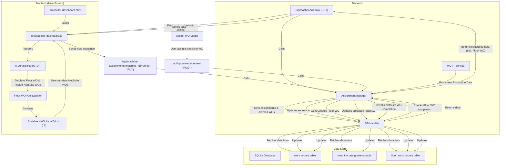

# Autocoiler Dashboard Implementation Plan

This plan outlines the creation of a new UI screen featuring 5 vertical panes for autocoilers, displaying assigned work orders, and incorporating "Floor Work Order Numbers" for enhanced management.

### **Phase 1: Design and Structure the New UI Screen**

**Goal:** Create a dedicated, visually distinct screen for monitoring autocoilers and their assigned work orders.

**1. New HTML File (`frontend/autocoiler-dashboard.html`):**
*   This file will serve as the main entry point for the new dashboard.
*   It will contain the basic HTML structure, including a container for the 5 vertical panes.
*   Include links to necessary CSS and JavaScript files (including SortableJS CDN).

**2. New JavaScript File (`frontend/js/autocoiler-dashboard.js`):**
*   This file will encapsulate all the logic for fetching data, rendering the panes and work orders, and handling user interactions for this specific screen.

**3. HTML Structure within `autocoiler-dashboard.html`:**
*   A main `div` container (e.g., `id="autocoiler-panes"`) that will hold the 5 vertical panes.
*   Each pane will be a `div` (e.g., `class="autocoiler-pane"`) representing an autocoiler.
*   Inside each autocoiler pane:
    *   A header displaying the machine ID/name (e.g., "Autocoiler-1").
    *   A section for the "Floor Work Order" details (collapsible).
        *   Floor Work Order Number (e.g., "FWOD-YYMMDD-MACHINE_ID")
        *   Overall completion status for the Floor WO (based on associated NetSuite WOs).
    *   A list (`ul` or a series of `div`s, e.g., `class="assigned-wo-list"`) to display the assigned NetSuite work orders. This list will be made sortable using SortableJS.
    *   Each NetSuite work order item (`li` or `div` within the list) will display:
        *   Work Order Number (`wo.work_order_no`)
        *   MCPL Part Code (`wo.mcpl_part_code`)
        *   Total Quantity (`wo.total_quantity`)
        *   Produced Quantity (`wo.produced_quantity`)
        *   Completion Percentage (`(produced_quantity / total_quantity) * 100`)
        *   Completion Status (e.g., "Completed" or "In Progress")
    *   Consider adding streamlined "Assign WO" and "Activate/Deactivate Print" buttons within each pane, similar to the current operations page.

**4. CSS Styling (within `autocoiler-dashboard.html` or a new CSS file):**
*   Utilize **CSS Grid** or **Flexbox** to create the 5 vertical pane layout, ensuring they are evenly distributed and visually distinct.
*   Define styles for:
    *   `autocoiler-pane`: Background, border, padding, shadow.
    *   `assigned-wo-list`: List styling (no bullets, padding).
    *   `assigned-wo-list li`: Individual work order item styling (background, margin, padding, border-radius, `cursor: grab`).
    *   Visual cues for completion (e.g., a small progress bar or color change based on completion percentage).
    *   Styling for collapsible Floor Work Order section.

### **Phase 2: Implement Frontend Logic for the New Screen**

**Goal:** Dynamically populate the new screen with data and enable user interactions.

**1. Data Fetching (`frontend/js/autocoiler-dashboard.js`):**
*   Fetch machine assignments and their assigned work orders from the `/api/dashboard-data` endpoint. This endpoint already provides the `assignments` array, which now includes `assigned_work_orders` (ordered by the custom sequence if set) and `produced_quantity`.

**2. Dynamic Rendering (`frontend/js/autocoiler-dashboard.js`):**
*   Implement a function (e.g., `renderAutocoilerPanes`) that iterates through the fetched `assignments` data.
*   For each assignment, dynamically create an autocoiler pane and populate it with the machine's details, its Floor Work Order (if applicable), and its `assigned_work_orders`.
*   Calculate and display the completion percentage and status for each NetSuite work order and the overall Floor Work Order.

**3. Drag-and-Drop Integration (`frontend/js/autocoiler-dashboard.js`):**
*   Initialize SortableJS on each `assigned-wo-list` within the autocoiler panes.
*   Implement an `onEnd` event handler for SortableJS that captures the `machine_id` and the new `ordered_work_order_ids`.
*   Call the existing `PUT /api/machine-assignments/{machine_id}/reorder` API endpoint with the updated sequence.
*   Handle the API response (success/failure) and update the UI if necessary (though SortableJS usually handles the visual reordering directly).

**4. Real-time Updates:**
*   Implement **Periodic Polling:** Set an `setInterval` to call `/api/dashboard-data` every few seconds (e.g., 5-10 seconds) to refresh all data and keep the `produced_quantity` and completion status up-to-date.

### **Phase 3: Backend Adjustments for Floor Work Orders**

**Goal:** Implement the logic for creating, linking, and tracking Floor Work Orders.

**1. Database Schema Update (`create_db.py`):**
*   **New table: `floor_work_orders`:**
    *   `id` INTEGER PRIMARY KEY AUTOINCREMENT
    *   `floor_wo_no` TEXT NOT NULL UNIQUE (e.g., "FWOD-YYMMDD-MACHINE_ID")
    *   `machine_id` INTEGER NOT NULL
    *   `creation_date` DATE NOT NULL
    *   `is_completed` INTEGER NOT NULL DEFAULT 0 (BOOLEAN)
    *   `completion_timestamp` TIMESTAMP NULL
    *   FOREIGN KEY (`machine_id`) REFERENCES `machine_assignments`(`machine_id`)
*   **Modify `work_orders` table:**
    *   Add `floor_wo_id` INTEGER NULL, FOREIGN KEY (`floor_wo_id`) REFERENCES `floor_work_orders`(`id`)

**2. New Functions in `db_handler.py`:**
*   `get_or_create_floor_work_order(machine_id, date)`: This function will check for an existing Floor WO for the given machine and date. If none exists, it will create one and return its ID and number.
*   `update_floor_work_order_completion(floor_wo_id)`: To mark a Floor WO as completed.
*   `get_floor_work_order_by_id(floor_wo_id)`: To retrieve Floor WO details.

**3. Modify `assignment_manager.py`:**
*   **`assign_work_order_to_machine`:**
    *   When a NetSuite Work Order is assigned, call `db_handler.get_or_create_floor_work_order` for the current date and machine ID.
    *   Link the NetSuite Work Order to this `floor_wo_id` in the `work_orders` table.
*   **`get_machine_assignments_with_ordered_work_orders`:**
    *   When fetching assignments, also retrieve the associated `floor_work_order` details and the completion status of all NetSuite WOs linked to that Floor WO to determine the Floor WO's overall completion.
*   **`track_production`:**
    *   After updating `produced_quantity` for a NetSuite Work Order, check if that NetSuite Work Order is now complete.
    *   If it is, check if all other NetSuite Work Orders associated with the same `floor_wo_id` are also complete. If so, mark the `floor_work_order` as completed using `db_handler.update_floor_work_order_completion`.

**4. Update `api.py` endpoints:**
*   Ensure `get_dashboard_data` (which calls `assignment_manager.get_machine_assignments_with_ordered_work_orders`) correctly retrieves and structures the data to include Floor Work Order information for the frontend.

### **Mermaid Diagram for Floor Work Order Integration:**

### **Potential Improvements (Future Considerations):**

*   **Floor WO Management UI:** Add UI elements to manually create/edit/complete Floor Work Orders if needed, beyond the automatic creation.
*   **Floor WO History:** A separate screen to view past Floor Work Orders and their associated NetSuite Work Orders.
*   **Inter-pane Drag-and-Drop (Floor WO):** Allow dragging NetSuite Work Orders between different Floor Work Orders (if they are for the same machine and day, or if the logic allows reassigning to a different Floor WO).
*   **Floor WO Filtering/Search:** Add search and filter capabilities for Floor Work Orders.

---
